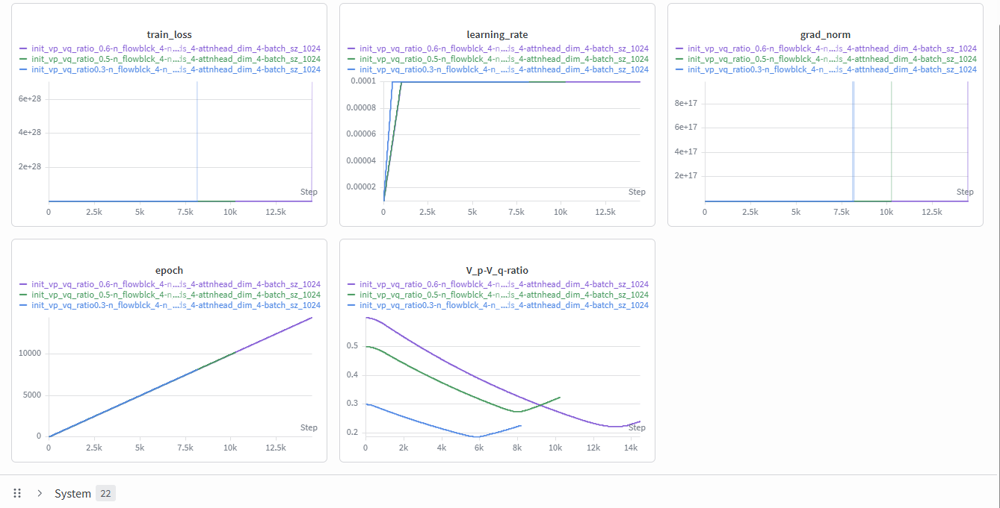

# Learnable $V_p/V_q$ Ratio Application
### Training Dynamics   

- Observations
    - Model reduces the $V_p/V_q$ ratio until some point.
        - This may mean, increasing the power of $V_q$ is necessary at the beginning of the training
        - Aligns with the fixed $V_p/V_q=0.3$ experiment that learned more complex circular shape
    - But at some point, model increases the $V_p/V_q$ ratio.
        - This relates with the training failure case where maintaining low $V_p/V_q$ ratio leads to $V_q$ explosion.

  

### 2D-Arrow Diagram
|Initital $V_p/V_q$|1.0|0.6|0.5|
|:-:|:-:|:-:|:-:|
|GIF||||
|Final Shape||||